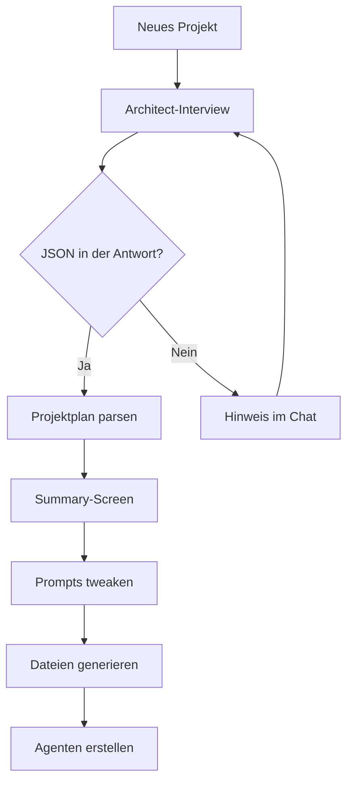

# Agent Studio – Android KI-Agenten-App

[](https://github.com/bertiger-cell/android-agents-app/actions)


Erstelle Projekte, lass den **Architect-Agenten** deine Idee per Interview in einen
fertigen Projekt-Plan verwandeln und arbeite anschließend mit spezialisierten KI-Agenten.
Chat mit **OpenRouter**, **OpenCode Zen** oder **Ollama** (Cloud oder lokal) – mit
Streaming-Antworten direkt auf dem Handy.

---

## Features

**Projekt- & Agenten-Management**
- Dashboard/Welcome-Screen „Agent Studio“
- Projekte erstellen, bearbeiten, löschen (mit Sicherheitsabfrage)
- Projekt-Detail mit 3 Tabs: **Agenten**, **Sessions**, **Dateien**
- Spezialisierte Agenten pro Projekt mit eigenem Provider, Modell, System-Prompt und Temperatur
- Discovery-Interview jederzeit neu starten

**Architect-Flow**
- Automatisches 3-Phasen-Interview bei neuer Projekt-Erstellung
- Warm-Up → strukturiertes Interview → JSON-Projektplan
- Summary-Screen: Plan ansehen, Agent-Prompts editieren, „Fertig!“ zum Abschluss
- Generiert automatisch:
  - `ARCHITECTURE.md`
  - `ROADMAP.md`
  - `RULES.md`
  - `SKILLS.md`
  - `AGENTS.md`
  - `diary.md` (Projekt-Tagebuch)
  - `discovery.json` (Roh-JSON)
- Erstellt aus dem Plan passende Agenten mit Namen, Beschreibung und System-Prompt

**Chat**
- Streaming-Antworten Token für Token (SSE/NDJSON)
- OpenRouter, OpenCode Zen, Ollama Cloud + lokal
- Session-Titel automatisch generiert oder manuell änderbar
- Chat-Verlauf wird in Room persistiert
- API-Kontext wird für große Sessions auf die letzten 50 Nachrichten begrenzt

**Einstellungen**
- API-Keys pro Provider (persistent via DataStore)
- Ollama-Verbindungstest
- Architect-System-Prompt editierbar
- Architect-Provider und -Modell frei wählbar

**Dateien**
- File-Viewer im Projekt: `.md` und `.json` direkt in der App lesen
- Datei-Größe, Änderungsdatum und Refresh

---

## Architect-Flow



---

## Tests

26 Unit-Tests, ausgeführt in GitHub Actions (`./gradlew test`):

| Suite | Fokus |
|---|---|
| `ArchitectJsonExtractionTest` | JSON-Extraktion aus Architect-Antworten |
| `ProjectScaffoldParsingTest` | JSON-Struktur mit Gson validieren |
| `AgentModelsTest` | Datenmodelle: AgentSpec, ProjectScaffold, Phasen, Discovery |
| `ArchitectSummaryModelsTest` | AgentSpecWithEditedPrompt-Konvertierung |
| `MessageHistoryTest` | History-Begrenzung und Reihenfolge |

---

## Build & Verifikation

```bash
./gradlew assembleDebug   # Debug-APK bauen
./gradlew lint            # Lint prüfen
./gradlew test            # Unit-Tests ausführen
```

## Stack

Kotlin 1.9, Jetpack Compose (Material 3), Room, DataStore, OkHttp, Gson,
Navigation Compose, Coroutines/Flow.

## Dokumentation

- [ARCHITECT_FLOW.md](ARCHITECT_FLOW.md) – Portable Spezifikation des Architect-Prozesses
- [ARCHITECTURE.md](ARCHITECTURE.md) – Architektur und Package-Struktur
- [ROADMAP.md](ROADMAP.md) – Fahrplan (in Bearbeitung)
- [RULES.md](RULES.md) – Projekt-Regeln
- [AGENTS.md](AGENTS.md) – Agenten-Rollen und Skills
