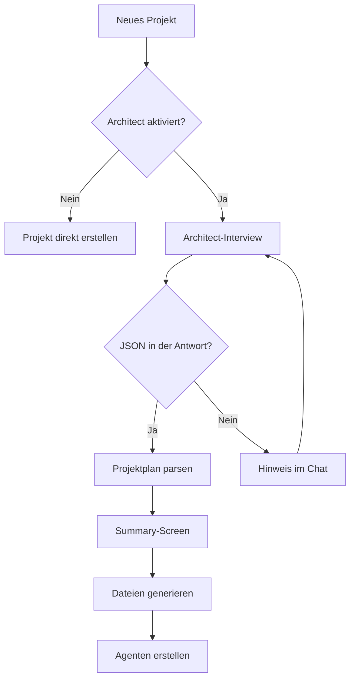

# Agent Studio - Android KI-Agenten-App

[](https://github.com/bertiger-cell/android-agents-app/actions)


Agent Studio ist eine Android-App zum Erstellen, Strukturieren und Chatten mit KI-Projekten.
Der Architect-Agent ist optional und per Settings-Toggle deaktivierbar. Wenn er aktiv ist,
startet er beim Anlegen eines neuen Projekts ein Interview, generiert daraus einen Projektplan
und schreibt die Projektdateien.

Chat mit OpenRouter, OpenCode Zen oder Ollama - lokal oder cloudbasiert - mit Streaming
Token für Token direkt auf dem Handy.

---

## V1.0 Feature Set

**Projekt- und Agenten-Management**
- Dashboard/Welcome-Screen "Agent Studio"
- Projekte erstellen, bearbeiten und löschen
- Projekt-Detail mit 3 Tabs: Agenten, Sessions, Dateien
- Spezialisierte Agenten pro Projekt mit Provider, Modell, System-Prompt und Temperatur

**Architect-Flow**
- Optionales 3-Phasen-Interview bei neuer Projekt-Erstellung
- Default: deaktiviert, aktivierbar in den Settings
- Warm-Up -> strukturiertes Interview -> JSON-Projektplan
- Summary-Screen: Plan ansehen, Agent-Prompts editieren, "Fertig!" zum Abschluss
- Generiert automatisch:
  - `ARCHITECTURE.md`
  - `ROADMAP.md`
  - `RULES.md`
  - `SKILLS.md`
  - `AGENTS.md`
  - `diary.md`
  - `discovery.json`
- Erstellt passende Agenten aus dem Plan

**Chat**
- Streaming-Antworten Token für Token
- Provider: OpenRouter, OpenCode Zen, Ollama
- Chat-Verlauf wird in Room persistiert
- Session-Titel manuell änderbar
- API-Kontext wird auf die letzten 50 Nachrichten begrenzt

**Einstellungen**
- API-Keys pro Provider persistent via DataStore
- Ollama-Verbindungstest
- Architect-System-Prompt editierbar
- Architect-Provider und -Modell frei wählbar
- Architect Discovery per Toggle aktivierbar/deaktivierbar

**Dateien**
- File-Viewer im Projekt für `.md` und `.json`
- Datei-Größe, Änderungsdatum und Refresh

---

## Quick Start

1. App installieren oder lokal starten.
2. In den Settings API-Keys für den gewünschten Provider setzen.
3. Optional Architect Discovery aktivieren.
4. Neues Projekt erstellen.
5. Mit einem Agenten chatten oder den Architect-Prozess nutzen.

---

## Known Limitations

- Kein LiteRT/On-Device-LLM in V1.0
- Kein RAG
- Keine Telegram-, RSS- oder Workflow-Automation
- Kein Cloud-Sync
- Keine Image-Generation

---

## Architect-Flow



---

## Tests

7 Unit-Test-Suiten, ausgeführt in GitHub Actions mit `./gradlew test`:

| Suite | Fokus |
|---|---|
| `ArchitectJsonExtractionTest` | JSON-Extraktion aus Architect-Antworten |
| `ProjectScaffoldParsingTest` | JSON-Struktur mit Gson validieren |
| `AgentModelsTest` | Datenmodelle: Agents, Sessions, Discovery, Scaffold |
| `ArchitectSummaryModelsTest` | ArchitectSummary-Konvertierung |
| `MessageHistoryTest` | History-Begrenzung und Reihenfolge |
| `NavigationTest` | Navigation und Overlay-Regeln |
| `AIProviderServiceTest` | Streaming-Parsing und Provider-Fehlerfälle |

---

## Build & Verifikation

```bash
./gradlew assembleDebug   # Debug-APK bauen
./gradlew lint            # Lint prüfen
./gradlew test            # Unit-Tests ausführen
```

## Stack

Kotlin 1.9, Jetpack Compose (Material 3), Room, DataStore, OkHttp, Gson,
Navigation Compose, Coroutines/Flow.

## Dokumentation

- [ARCHITECT_FLOW.md](ARCHITECT_FLOW.md) - Spezifikation des Architect-Prozesses
- [ARCHITECTURE.md](ARCHITECTURE.md) - Architektur und Package-Struktur
- [ROADMAP.md](ROADMAP.md) - Fahrplan
- [RULES.md](RULES.md) - Projekt-Regeln
- [AGENTS.md](AGENTS.md) - Agenten-Rollen und Skills
- [CHANGELOG.md](CHANGELOG.md) - v1.0-Aenderungen
